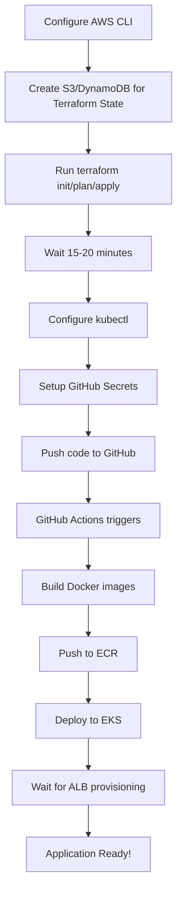
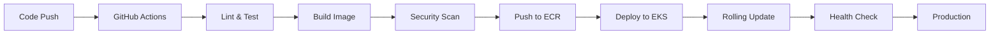

# AWS Infrastructure Summary

## Complete Infrastructure and Deployment Setup

This document provides a complete overview of all infrastructure, Docker, Kubernetes, and CI/CD components created for deploying the Credit Card Recommendation System to AWS EKS.

---

## 📦 Files Created

### Docker Configuration

#### Backend
- **[credit-card-backend/Dockerfile](credit-card-backend/Dockerfile)**
  - Multi-stage Python Flask container
  - Includes Tesseract OCR for fraud detection
  - Gunicorn production server with 4 workers
  - Health check endpoint
  - Size-optimized with slim base image

- **[credit-card-backend/requirements.txt](credit-card-backend/requirements.txt)**
  - All Python dependencies with pinned versions
  - Flask, OpenAI, LangChain, PyMongo, Tesseract

- **[credit-card-backend/.dockerignore](credit-card-backend/.dockerignore)**
  - Excludes unnecessary files from Docker context
  - Reduces image build time and size

#### Frontend
- **[credit-card-frontend/Dockerfile](credit-card-frontend/Dockerfile)**
  - Multi-stage build: Node.js build → Nginx serve
  - Production-optimized React build
  - Nginx web server with custom configuration
  - Health check endpoint

- **[credit-card-frontend/nginx.conf](credit-card-frontend/nginx.conf)**
  - Custom Nginx configuration
  - GZIP compression enabled
  - Security headers
  - React Router support
  - API proxy configuration (optional)

- **[credit-card-frontend/.dockerignore](credit-card-frontend/.dockerignore)**
  - Excludes node_modules and build artifacts

---

### Kubernetes Manifests

Located in [k8s/base/](k8s/base/)

#### Core Resources

1. **[namespace.yaml](k8s/base/namespace.yaml)**
   - Creates `credit-card-system` namespace
   - Isolates application resources

2. **[configmap.yaml](k8s/base/configmap.yaml)**
   - Backend configuration (Flask, MongoDB settings)
   - Frontend configuration (API URL)

3. **[secret.yaml](k8s/base/secret.yaml)**
   - Stores sensitive data (OpenAI API key)
   - Base64 encoded secrets

#### Database

4. **[mongodb-deployment.yaml](k8s/base/mongodb-deployment.yaml)**
   - MongoDB 6.0 deployment
   - PersistentVolumeClaim (20GB GP3 EBS)
   - ClusterIP Service on port 27017
   - Liveness and readiness probes
   - Resource limits (512Mi-2Gi memory, 250m-1000m CPU)

#### Backend Application

5. **[backend-deployment.yaml](k8s/base/backend-deployment.yaml)**
   - Flask backend deployment (3 replicas)
   - ECR image reference
   - Environment variables from ConfigMap and Secret
   - Health checks on /health endpoint
   - Rolling update strategy
   - HorizontalPodAutoscaler (3-10 pods, 70% CPU threshold)
   - ClusterIP Service on port 5001

#### Frontend Application

6. **[frontend-deployment.yaml](k8s/base/frontend-deployment.yaml)**
   - React frontend deployment (3 replicas)
   - ECR image reference
   - Nginx serving static files
   - Health checks on /health endpoint
   - Rolling update strategy
   - HorizontalPodAutoscaler (3-10 pods, 70% CPU threshold)
   - ClusterIP Service on port 80

#### Ingress

7. **[ingress.yaml](k8s/base/ingress.yaml)**
   - AWS Application Load Balancer ingress
   - Routes /api/* to backend service
   - Routes /* to frontend service
   - Health check configuration
   - SSL/TLS annotations (ready for HTTPS)

---

### Terraform Infrastructure as Code

Located in [terraform/](terraform/)

#### Main Configuration

1. **[main.tf](terraform/main.tf)**
   - Main Terraform configuration
   - Provider setup (AWS, Kubernetes, Helm)
   - S3 backend for state management
   - Module orchestration
   - AWS Load Balancer Controller Helm chart
   - Metrics Server Helm chart

2. **[variables.tf](terraform/variables.tf)**
   - AWS region (default: us-east-1)
   - Project name (credit-card-system)
   - Environment (production)
   - VPC CIDR (10.0.0.0/16)
   - Availability zones (3)
   - EKS cluster version (1.28)
   - Node group configuration
   - Instance types

3. **[outputs.tf](terraform/outputs.tf)**
   - VPC ID and subnet IDs
   - EKS cluster name and endpoint
   - ECR repository URLs
   - kubectl configuration command
   - ALB controller role ARN

#### VPC Module

Located in [terraform/modules/vpc/](terraform/modules/vpc/)

- **main.tf**: VPC, subnets, NAT gateways, route tables
- **variables.tf**: VPC configuration variables
- **outputs.tf**: VPC resource outputs

**Created Resources:**
- VPC with DNS enabled
- 3 Public subnets (one per AZ)
- 3 Private subnets (one per AZ)
- Internet Gateway
- 3 NAT Gateways with Elastic IPs
- Public route table
- 3 Private route tables
- Route table associations

#### EKS Module

Located in [terraform/modules/eks/](terraform/modules/eks/)

- **main.tf**: EKS cluster, node group, add-ons
- **variables.tf**: EKS configuration variables
- **outputs.tf**: EKS resource outputs

**Created Resources:**
- EKS cluster IAM role
- EKS cluster security group
- EKS cluster (Kubernetes 1.28)
- OIDC provider for IRSA
- EKS node group IAM role
- EKS managed node group (2-10 t3.medium instances)
- EKS add-ons:
  - EBS CSI Driver
  - VPC CNI
  - CoreDNS
  - Kube-proxy

#### ECR Module

Located in [terraform/modules/ecr/](terraform/modules/ecr/)

- **main.tf**: ECR repositories and policies
- **variables.tf**: ECR configuration variables
- **outputs.tf**: ECR repository URLs

**Created Resources:**
- ECR repository: credit-card-backend-production
- ECR repository: credit-card-frontend-production
- Image scanning enabled
- Lifecycle policy (keep last 10 images)
- Repository policies

#### IAM Module

Located in [terraform/modules/iam/](terraform/modules/iam/)

- **main.tf**: IAM roles and policies for service accounts
- **variables.tf**: IAM configuration variables
- **outputs.tf**: IAM role ARNs

**Created Resources:**
- AWS Load Balancer Controller IAM role
- AWS Load Balancer Controller policy
- IRSA trust relationship with OIDC provider

---

### CI/CD Pipelines

Located in [.github/workflows/](.github/workflows/)

#### 1. Backend Pipeline

**[backend-deploy.yml](.github/workflows/backend-deploy.yml)**

**Jobs:**
- **lint-and-test**: Python linting (flake8, black), tests (pytest)
- **build-and-push**: Docker build, security scan (Trivy), push to ECR
- **deploy-to-eks**: Update kubeconfig, apply manifests, rollout, smoke tests
- **notify**: Deployment status notifications

**Triggers:**
- Push to main/develop (paths: credit-card-backend/**)
- Pull request to main/develop
- Manual workflow dispatch

**Features:**
- Docker layer caching
- Multi-architecture builds (linux/amd64)
- Image tagging (latest, git-sha, semver)
- Vulnerability scanning with Trivy
- SARIF upload to GitHub Security
- Automated kubectl deployment
- Health check verification

#### 2. Frontend Pipeline

**[frontend-deploy.yml](.github/workflows/frontend-deploy.yml)**

**Jobs:**
- **lint-and-test**: ESLint, React tests, production build
- **build-and-push**: Docker build, security scan, push to ECR
- **deploy-to-eks**: Update kubeconfig, apply manifests, rollout, smoke tests
- **notify**: Deployment status notifications

**Triggers:**
- Push to main/develop (paths: credit-card-frontend/**)
- Pull request to main/develop
- Manual workflow dispatch

**Features:**
- npm ci for reproducible builds
- Build artifact upload
- Docker layer caching
- Vulnerability scanning
- Automated deployment
- Frontend and backend health checks

#### 3. Terraform Pipeline

**[terraform-deploy.yml](.github/workflows/terraform-deploy.yml)**

**Jobs:**
- **terraform-validate**: Format check, init, validate
- **terraform-plan**: Generate and upload plan for PRs
- **terraform-apply**: Apply infrastructure changes on main
- **terraform-destroy**: Manual destroy workflow

**Triggers:**
- Push to main (paths: terraform/**)
- Pull request to main
- Manual workflow dispatch (for destroy)

**Features:**
- Terraform format validation
- Plan comments on PRs
- State locking with DynamoDB
- Remote state in S3
- Production environment protection
- Deployment summaries

---

## 🏗️ Infrastructure Architecture

### Network Architecture

```
VPC: 10.0.0.0/16
├── AZ 1 (us-east-1a)
│   ├── Public Subnet: 10.0.0.0/20
│   │   └── NAT Gateway
│   └── Private Subnet: 10.0.48.0/20
│       └── EKS Nodes
├── AZ 2 (us-east-1b)
│   ├── Public Subnet: 10.0.16.0/20
│   │   └── NAT Gateway
│   └── Private Subnet: 10.0.64.0/20
│       └── EKS Nodes
└── AZ 3 (us-east-1c)
    ├── Public Subnet: 10.0.32.0/20
    │   └── NAT Gateway
    └── Private Subnet: 10.0.80.0/20
        └── EKS Nodes
```

### Application Architecture

```
Internet
    │
    ▼
┌─────────────────────────┐
│ Application Load Balancer│
└─────────────────────────┘
    │                  │
    │ /api/*          │ /*
    ▼                  ▼
┌──────────────┐   ┌──────────────┐
│   Backend    │   │  Frontend    │
│  Service     │◄──│  Service     │
│  (Flask)     │   │  (React)     │
│  Port: 5001  │   │  Port: 80    │
└──────────────┘   └──────────────┘
    │
    ▼
┌──────────────┐
│   MongoDB    │
│  Service     │
│  Port: 27017 │
└──────────────┘
```

### Container Registry

```
ECR Repositories
├── credit-card-backend-production
│   ├── latest
│   ├── main-abc1234
│   └── v1.0.0
└── credit-card-frontend-production
    ├── latest
    ├── main-def5678
    └── v1.0.0
```

---

## 🔐 Security Features

### Container Security
- ✅ Image scanning with Trivy
- ✅ Vulnerability reporting to GitHub Security
- ✅ Non-root containers
- ✅ Read-only file systems where applicable
- ✅ Security headers in Nginx
- ✅ Secrets stored in Kubernetes Secrets (base64)

### Network Security
- ✅ Private subnets for worker nodes
- ✅ Security groups with minimal permissions
- ✅ NAT Gateways for outbound traffic
- ✅ No direct internet access to pods

### Access Control
- ✅ IAM roles for service accounts (IRSA)
- ✅ RBAC in Kubernetes
- ✅ ECR repository policies
- ✅ EKS cluster endpoint access control

### Secrets Management
- ✅ GitHub Secrets for CI/CD credentials
- ✅ Kubernetes Secrets for application secrets
- ✅ AWS Systems Manager Parameter Store ready
- ✅ AWS Secrets Manager ready

---

## 📊 Monitoring and Logging

### CloudWatch Integration
- EKS cluster logs (API, audit, authenticator, controller manager, scheduler)
- Container Insights (optional)
- Log aggregation from all pods

### Kubernetes Metrics
- Metrics Server for HPA
- Resource usage monitoring (CPU, memory)
- Pod autoscaling based on metrics

### Health Checks
- Liveness probes: Restart unhealthy containers
- Readiness probes: Remove unready pods from load balancer
- Health endpoints: /health on all services

---

## 💰 Cost Breakdown

### Monthly Costs (Production)

| Resource | Quantity | Unit Cost | Monthly Cost |
|----------|----------|-----------|--------------|
| EKS Cluster | 1 | $0.10/hour | $72 |
| EC2 t3.medium | 3 | $0.0416/hour | $90 |
| NAT Gateway | 3 | $0.045/hour | $97 |
| Data Processing | Variable | $0.045/GB | $20-50 |
| ALB | 1 | $0.0225/hour | $16 |
| EBS GP3 | 50GB x 3 | $0.08/GB-month | $12 |
| Data Transfer | Variable | $0.09/GB | $10-30 |
| **Total** | | | **~$320-370** |

### Cost Optimization Tips
- Use Spot instances for non-production (60-90% savings)
- Single NAT gateway for dev (save $65/month)
- Right-size instance types (use t3.small)
- Delete unused images from ECR
- Use Reserved Instances for long-term (40% savings)

---

## 🚀 Deployment Workflows

### Initial Deployment



### Continuous Deployment



---

## 🎯 Production Readiness Checklist

### Before Going Live

- [ ] Configure custom domain (Route53)
- [ ] Setup SSL/TLS certificate (ACM)
- [ ] Enable HTTPS redirect
- [ ] Configure AWS WAF
- [ ] Setup CloudWatch alarms
- [ ] Configure backup strategy for MongoDB
- [ ] Setup log aggregation
- [ ] Configure monitoring dashboard
- [ ] Setup incident response plan
- [ ] Document disaster recovery procedures
- [ ] Configure auto-scaling policies
- [ ] Setup blue-green deployment
- [ ] Configure rate limiting
- [ ] Enable access logs
- [ ] Setup cost alerts
- [ ] Configure security scanning schedule

### Ongoing Maintenance

- [ ] Regular security updates
- [ ] Kubernetes version upgrades
- [ ] Cost optimization reviews
- [ ] Performance monitoring
- [ ] Backup verification
- [ ] Disaster recovery drills
- [ ] Documentation updates

---

## 📚 Documentation Links

- **Quick Start**: [QUICKSTART_AWS.md](QUICKSTART_AWS.md)
- **Full Deployment Guide**: [DEPLOYMENT.md](DEPLOYMENT.md)
- **Application README**: [README.md](README.md)

### External Resources

- [AWS EKS Documentation](https://docs.aws.amazon.com/eks/)
- [Kubernetes Documentation](https://kubernetes.io/docs/)
- [Terraform AWS Provider](https://registry.terraform.io/providers/hashicorp/aws/latest/docs)
- [GitHub Actions Documentation](https://docs.github.com/en/actions)
- [Docker Best Practices](https://docs.docker.com/develop/dev-best-practices/)

---

## 🆘 Support and Troubleshooting

### Common Issues

**Pods not starting**: Check image pull permissions, ECR repository exists, correct image tag

**ALB not provisioning**: Verify AWS Load Balancer Controller is running, check IAM role

**High costs**: Review instance types, NAT gateway usage, data transfer

**Slow performance**: Check HPA configuration, increase replicas, optimize container resources

### Getting Help

- GitHub Issues: [Create an issue](https://github.com/Vinod7723/Credit_card_recommendation/issues)
- AWS Support: [AWS Support Center](https://console.aws.amazon.com/support/)
- Community: Stack Overflow, Kubernetes Slack

---

## ✅ Summary

**Total Files Created**: 40+

**Infrastructure Components**:
- 2 Docker images (multi-stage optimized)
- 7 Kubernetes manifest files
- 15+ Terraform configuration files
- 3 CI/CD pipelines
- 3 comprehensive documentation files

**AWS Resources Created**:
- 1 VPC with 6 subnets
- 1 EKS cluster
- 1 managed node group
- 2 ECR repositories
- 1 Application Load Balancer
- 3 NAT Gateways
- Multiple IAM roles and policies
- CloudWatch log groups
- Security groups

**Kubernetes Resources**:
- 1 namespace
- 3 deployments (backend, frontend, mongodb)
- 3 services
- 1 ingress
- 2 HorizontalPodAutoscalers
- 1 PersistentVolumeClaim
- ConfigMaps and Secrets

**CI/CD Features**:
- Automated linting and testing
- Docker image building and pushing
- Security vulnerability scanning
- Automated Kubernetes deployment
- Rolling updates with zero downtime
- Health check verification
- Deployment notifications

---

**Status**: ✅ Complete and Production-Ready

**Last Updated**: January 2026

**Estimated Setup Time**: 30-40 minutes

**Deployment Method**: Fully automated with GitHub Actions + Manual Terraform option

**Cloud Provider**: Amazon Web Services (AWS)

**Container Orchestration**: Kubernetes (EKS)

**Infrastructure as Code**: Terraform

**CI/CD**: GitHub Actions
