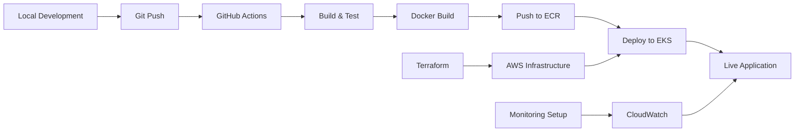

# AI-Powered Credit Card Recommendation System

> **Enterprise-grade AWS EKS deployment with complete CI/CD pipeline**
>
> **Author:** Vinod Reddy Billipalli
> **Stack:** AWS EKS | Terraform | Docker | Kubernetes | React | Flask | MongoDB

[](https://aws.amazon.com/eks/)
[](https://www.terraform.io/)
[](https://kubernetes.io/)
[](https://www.docker.com/)

---

## 📖 Overview

An intelligent credit card recommendation system that uses AI to analyze user financial profiles and recommend optimal credit cards. The system features document OCR for instant card scanning, AI-powered recommendations using OpenAI GPT, and order tracking capabilities.

### Key Features

- 🤖 **AI-Powered Recommendations**: OpenAI GPT integration for intelligent card matching
- 📄 **Document OCR**: Tesseract-based card scanning and data extraction
- 📦 **Order Management**: Complete order tracking and defect reporting
- 🔐 **Secure**: Production-ready security with secrets management
- 📊 **Monitored**: CloudWatch dashboards and alarms
- 🚀 **Auto-scaling**: HPA-based scaling (3-10 replicas)
- ⚡ **High Availability**: Multi-AZ deployment across 3 availability zones
- 🔄 **CI/CD**: Automated pipelines with GitHub Actions

---

## 🏗️ Architecture

```
┌──────────────────────────────────────────────────────────────┐
│                          Users                                │
└─────────────────────────┬────────────────────────────────────┘
                          │
                          ▼
┌──────────────────────────────────────────────────────────────┐
│              AWS Application Load Balancer                    │
│              (Multi-AZ, Auto-scaling)                         │
└────────────┬─────────────────────────┬───────────────────────┘
             │                         │
    Path: /* │                         │ Path: /api/*
             ▼                         ▼
    ┌────────────────┐       ┌────────────────┐
    │   Frontend     │       │    Backend     │
    │   (React +     │       │  (Flask API +  │
    │    Nginx)      │       │   OpenAI GPT)  │
    │                │       │                │
    │  3-10 replicas │       │  3-10 replicas │
    │  Auto-scaling  │       │  Auto-scaling  │
    └────────────────┘       └───────┬────────┘
                                     │
                                     ▼
                            ┌────────────────┐
                            │    MongoDB     │
                            │  (Persistent)  │
                            │    20GB EBS    │
                            └────────────────┘

All running on AWS EKS with Terraform-managed infrastructure
```

📐 **[View Complete Architecture →](./ARCHITECTURE.md)**

---

## 🚀 Quick Start

### Option 1: One-Command Deployment (Recommended)

```bash
# Clone repository
git clone <your-repo-url>
cd Credit_card_recommendation

# Run automated deployment
./deploy-to-aws.sh
```

**Time**: 20-25 minutes
**Result**: Production-ready application on AWS EKS

### Option 2: Manual Step-by-Step

Follow the comprehensive guide: **[DEPLOY_LIVE.md](./DEPLOY_LIVE.md)**

---

## 📂 Project Structure

```
Credit_card_recommendation/
├── credit-card-backend/          # Flask API backend
│   ├── main.py                   # Main application
│   ├── order_agent.py            # Order management
│   ├── models/                   # Data models
│   ├── Dockerfile                # Production container
│   └── requirements.txt          # Python dependencies
│
├── credit-card-frontend/         # React frontend
│   ├── src/                      # React components
│   ├── public/                   # Static assets
│   ├── Dockerfile                # Multi-stage build
│   └── nginx.conf                # Nginx configuration
│
├── terraform/                    # Infrastructure as Code
│   ├── main.tf                   # Main configuration
│   ├── variables.tf              # Input variables
│   ├── outputs.tf                # Output values
│   ├── versions.tf               # Provider versions
│   ├── terraform.tfvars          # Variable values
│   └── modules/                  # Reusable modules
│       ├── vpc/                  # VPC module
│       ├── eks/                  # EKS cluster module
│       ├── ecr/                  # Container registry
│       └── iam/                  # IAM roles
│
├── k8s/                          # Kubernetes manifests
│   └── base/
│       ├── namespace.yaml        # Namespace definition
│       ├── configmap.yaml        # Configuration
│       ├── secret.yaml           # Secrets template
│       ├── mongodb-deployment.yaml
│       ├── backend-deployment.yaml
│       ├── frontend-deployment.yaml
│       └── ingress.yaml          # ALB ingress
│
├── .github/workflows/            # CI/CD pipelines
│   ├── backend-deploy.yml        # Backend pipeline
│   ├── frontend-deploy.yml       # Frontend pipeline
│   └── terraform-deploy.yml      # Infrastructure pipeline
│
├── deploy-to-aws.sh             # Automated deployment script
├── setup-monitoring.sh          # CloudWatch setup script
│
└── Documentation/
    ├── ARCHITECTURE.md          # Complete architecture
    ├── DEPLOY_LIVE.md           # Deployment guide
    ├── GITHUB_SETUP.md          # CI/CD setup
    └── AWS_INFRASTRUCTURE_SUMMARY.md
```

---

## 🛠️ Technology Stack

### Frontend
- **Framework**: React 18+
- **UI Library**: Material-UI
- **Build Tool**: Create React App
- **Web Server**: Nginx 1.25
- **Container**: Docker multi-stage build

### Backend
- **Framework**: Flask (Python 3.12)
- **WSGI Server**: Gunicorn (4 workers)
- **AI**: OpenAI GPT API
- **OCR**: Tesseract
- **Database**: MongoDB 6.0

### Infrastructure
- **Cloud**: AWS (us-east-1)
- **Orchestration**: Kubernetes (EKS 1.28)
- **IaC**: Terraform 1.5+
- **Container Registry**: Amazon ECR
- **Load Balancer**: AWS ALB
- **Monitoring**: CloudWatch + Container Insights
- **Networking**: VPC with 3 public + 3 private subnets

### DevOps
- **CI/CD**: GitHub Actions
- **Version Control**: Git
- **Secrets**: Kubernetes Secrets + GitHub Secrets
- **Container Runtime**: Docker

---

## 📊 Infrastructure Details

### AWS Resources Created

| Resource | Configuration | Purpose |
|----------|--------------|---------|
| **VPC** | 10.0.0.0/16 | Network isolation |
| **Subnets** | 3 public + 3 private | Multi-AZ deployment |
| **NAT Gateways** | 3 (one per AZ) | Outbound internet |
| **EKS Cluster** | v1.28 | Kubernetes control plane |
| **Node Group** | 3x t3.medium (2-10) | Worker nodes |
| **ECR Repos** | 2 (backend + frontend) | Container images |
| **ALB** | Internet-facing | Load balancing |
| **EBS Volumes** | 20GB GP3 | MongoDB storage |
| **CloudWatch** | Dashboard + 5 alarms | Monitoring |
| **SNS Topic** | Email alerts | Notifications |

### Estimated Costs

| Component | Monthly Cost |
|-----------|-------------|
| EKS Cluster | $73 |
| EC2 (3x t3.medium) | $90 |
| NAT Gateways (3) | $100 |
| ALB | $20 |
| Other (EBS, ECR, CloudWatch) | $25 |
| **Total** | **~$308/month** |

💡 **Optimization**: Can reduce to ~$180/month with 1 NAT Gateway and t3.small instances

---

## 📈 Monitoring & Observability

### CloudWatch Dashboard: `VinodCreditCardSystem`

**Metrics Tracked**:
- EKS cluster health and node count
- ALB response time and request count
- HTTP status codes (2xx, 4xx, 5xx)
- Target health status
- CPU and memory utilization
- Network traffic

### CloudWatch Alarms (5 Configured)

1. ⚠️ High CPU Utilization (>80%)
2. ⚠️ Unhealthy Targets (≥1)
3. ⚠️ High 5XX Errors (>10 in 5 min)
4. ⚠️ High Response Time (>2s)
5. ⚠️ EKS Node Failures (≥1)

**Setup**: Run `./setup-monitoring.sh`

---

## 🔄 CI/CD Pipeline

### Automated Workflows

#### Backend Pipeline
```
Push to main → Lint & Test → Build Docker → Push to ECR → Deploy to EKS
                  ↓              ↓              ↓             ↓
               flake8         Docker        Trivy scan    kubectl apply
               black          Buildx        Security      Rolling update
               pytest                       Check
```

#### Frontend Pipeline
```
Push to main → Lint & Test → Build Docker → Push to ECR → Deploy to EKS
                  ↓              ↓              ↓             ↓
               ESLint         Multi-stage   Trivy scan    kubectl apply
               npm audit      Build         Security      Rolling update
```

#### Terraform Pipeline
```
Push/PR → Validate → Plan → Apply (main only)
            ↓          ↓       ↓
         fmt -check   Review   Create/Update
         validate   Comment     Infrastructure
```

**Setup**: See [GITHUB_SETUP.md](./GITHUB_SETUP.md)

---

## 🔐 Security Features

- ✅ **Network Isolation**: Private subnets for worker nodes
- ✅ **Secrets Management**: Kubernetes secrets + GitHub secrets
- ✅ **Security Scanning**: Trivy vulnerability scanning
- ✅ **RBAC**: Kubernetes role-based access control
- ✅ **IAM Roles**: IRSA for service accounts
- ✅ **Encryption**: EBS volumes encrypted
- ✅ **Container Security**: Non-root users, read-only filesystem

---

## 📚 Documentation

| Document | Description |
|----------|-------------|
| **[ARCHITECTURE.md](./ARCHITECTURE.md)** | Complete architecture documentation with diagrams |
| **[DEPLOY_LIVE.md](./DEPLOY_LIVE.md)** | Step-by-step deployment guide |
| **[GITHUB_SETUP.md](./GITHUB_SETUP.md)** | CI/CD pipeline configuration |
| **[AWS_INFRASTRUCTURE_SUMMARY.md](./AWS_INFRASTRUCTURE_SUMMARY.md)** | Infrastructure summary |
| **[DEPLOYMENT.md](./DEPLOYMENT.md)** | Original deployment documentation |

---

## 🎯 Deployment Workflow



---

## ✅ Features Checklist

### Core Functionality
- [x] AI-powered credit card recommendations
- [x] Document OCR for card scanning
- [x] Order placement and tracking
- [x] Defect reporting system
- [x] Real-time chat interface

### DevOps & Infrastructure
- [x] Terraform infrastructure as code
- [x] Docker containerization
- [x] Kubernetes orchestration
- [x] AWS EKS deployment
- [x] Auto-scaling (HPA)
- [x] Multi-AZ high availability

### CI/CD
- [x] GitHub Actions pipelines
- [x] Automated testing
- [x] Security scanning (Trivy)
- [x] Automated deployments
- [x] Rolling updates

### Monitoring & Observability
- [x] CloudWatch dashboards
- [x] CloudWatch alarms
- [x] Container Insights
- [x] Email alerts (SNS)
- [x] Application logging

### Security
- [x] Secrets management
- [x] Network isolation
- [x] RBAC configuration
- [x] IAM roles (IRSA)
- [x] Security scanning

---

## 🚦 Getting Started

### Prerequisites

```bash
# Install AWS CLI
brew install awscli  # macOS
# or download from: https://aws.amazon.com/cli/

# Install Terraform
brew install terraform  # macOS
# or download from: https://www.terraform.io/downloads

# Install kubectl
brew install kubectl  # macOS
# or download from: https://kubernetes.io/docs/tasks/tools/

# Install Helm
brew install helm  # macOS
# or download from: https://helm.sh/docs/intro/install/

# Install Docker
# Download from: https://www.docker.com/products/docker-desktop
```

### Configuration

```bash
# Configure AWS credentials
aws configure
# Enter: Access Key ID, Secret Access Key, Region (us-east-1)

# Get OpenAI API Key
# Visit: https://platform.openai.com/api-keys
```

### Deploy

```bash
# Clone and deploy
git clone <repo-url>
cd Credit_card_recommendation
./deploy-to-aws.sh
```

**That's it!** Your application will be live in ~20 minutes.

---

## 📝 Useful Commands

```bash
# View application status
kubectl get pods -n credit-card-system
kubectl get svc -n credit-card-system
kubectl get ingress -n credit-card-system

# View logs
kubectl logs -f deployment/backend -n credit-card-system
kubectl logs -f deployment/frontend -n credit-card-system

# Scale manually
kubectl scale deployment backend --replicas=5 -n credit-card-system

# Check auto-scaling
kubectl get hpa -n credit-card-system

# Update application
kubectl set image deployment/backend backend=<new-image> -n credit-card-system

# Rollback
kubectl rollout undo deployment/backend -n credit-card-system
```

---

## 🐛 Troubleshooting

### Common Issues

1. **Pods not starting**: Check logs with `kubectl logs <pod-name> -n credit-card-system`
2. **Load balancer not accessible**: Verify ALB is provisioned in AWS Console
3. **Backend can't connect to MongoDB**: Check service endpoints with `kubectl get endpoints -n credit-card-system`
4. **High costs**: Scale down nodes or use 1 NAT Gateway instead of 3

See complete troubleshooting guide in [DEPLOY_LIVE.md](./DEPLOY_LIVE.md#-troubleshooting)

---

## 🧹 Cleanup

```bash
# Delete application (keep infrastructure)
kubectl delete namespace credit-card-system

# Delete everything
cd terraform
terraform destroy -auto-approve
```

---

## 📞 Support & Contact

**Author**: Vinod Reddy Billipalli
**Purpose**: Demonstrating DevSecOps, FinOps, and Cloud Engineering expertise

### Skills Demonstrated

- ☁️ AWS Cloud Architecture (VPC, EKS, ECR, ALB, CloudWatch)
- 🏗️ Infrastructure as Code (Terraform)
- 🐳 Containerization (Docker, Kubernetes)
- 🔄 CI/CD Pipelines (GitHub Actions)
- 📊 Monitoring & Observability (CloudWatch, Container Insights)
- 🔐 Security Best Practices (IAM, RBAC, Secrets Management)
- 💰 FinOps & Cost Optimization
- 🚀 DevOps Best Practices

---

## 📄 License

This project is created for portfolio and demonstration purposes.

---

## 🎉 Acknowledgments

- React.js for the frontend framework
- Flask for the backend framework
- OpenAI for GPT API integration
- AWS for cloud infrastructure
- Kubernetes for container orchestration
- Terraform for infrastructure as code

---

**⭐ If this project demonstrates valuable skills, please star the repository!**

**🚀 Ready to deploy? Start with:** `./deploy-to-aws.sh`

---

*Last Updated: 2026-01-26*
